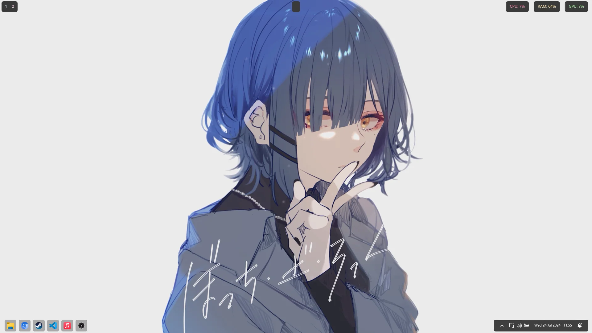
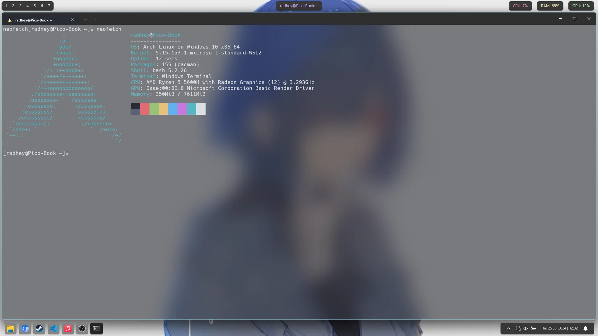
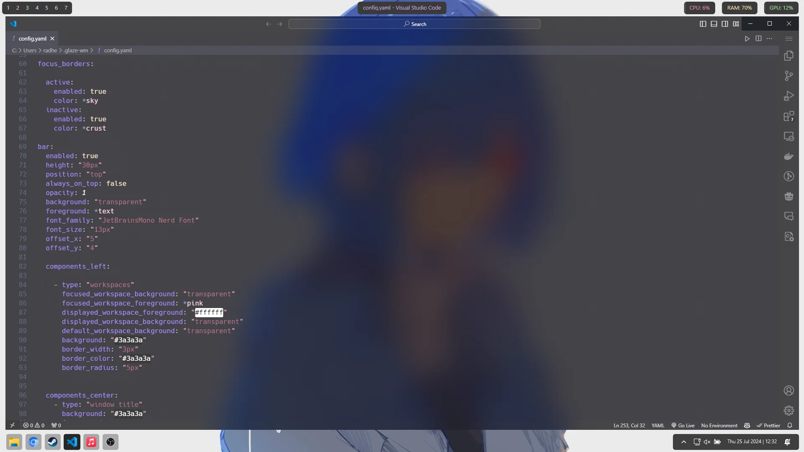
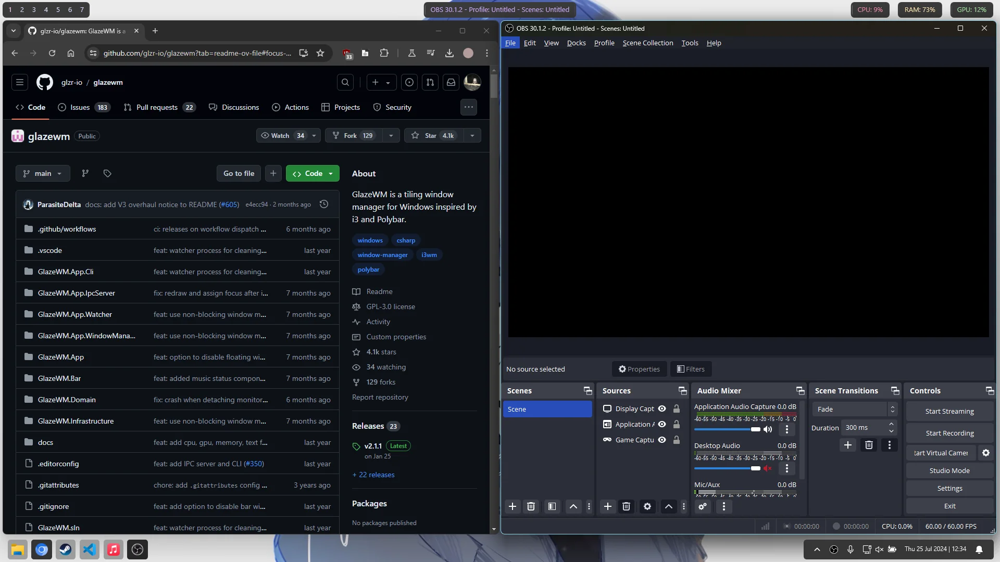

# Windows Dev Environment Config

<table>
  <tr>
    <td></td>
    <td></td>
  </tr>
  <tr>
    <td></td>
    <td></td>
  </tr>
</table>

(wallpaper link : https://steamcommunity.com/sharedfiles/filedetails/?id=3016260238)

## Contents

```
PowerShell/
  Microsoft.PowerShell_profile.ps1   # Console customizations & helper functions
  Modules/
    Terminal-Icons/0.11.0/           # Vendored Terminal-Icons module (icons & colors)
windhawk/                            # Windhawk tweak configurations
assets/                              # Reference images (wallpapers / screenshots)
README.md
```


## Features

- Enhanced PowerShell prompt (admin awareness, window title)
- Rich file/directory icons & color themes via Terminal-Icons
- Fast navigation & file helpers (mkcd, nf, ff, la, ll, grep, tail/head)
- Git workflow shortcuts (gs, ga, gc, gp, gcom, lazyg)
- System utilities (uptime, df, flushdns, Get-PubIP, trash)
- Environment bootstrap + cache cleaning
- Windhawk taskbar & UI tweaks (size, styling, clock)


## Windhawk Configs

See:
- [`modList.md`](windhawk/modList.md)
- JSON tweak files: [`clock.json`](windhawk/clock.json), [`taskbarSize.json`](windhawk/taskbarSize.json), [`taskbaricon.json`](windhawk/taskbaricon.json), [`taskbarstyler.json`](windhawk/taskbarstyler.json)

Import these via Windhawk UI to apply taskbar and clock customizations.
